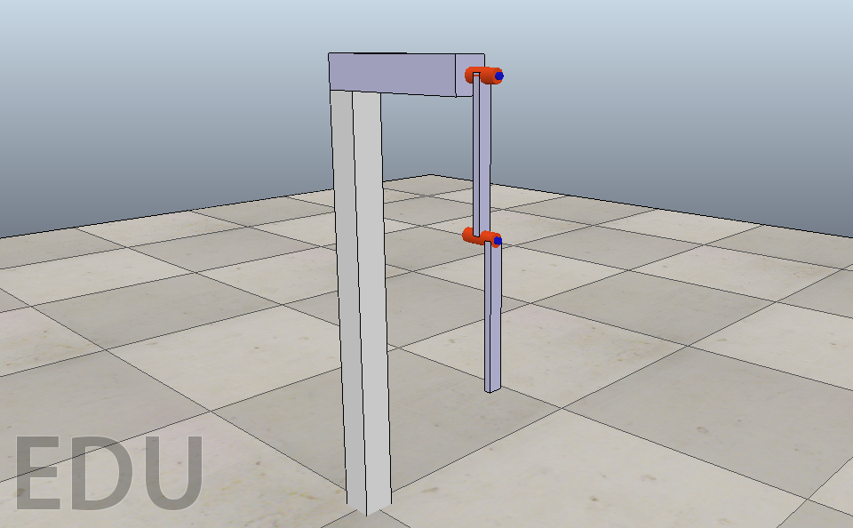

# acrobotVREP
An gym environment for acrobot in VREP. Using a similar approach a VREP-based reinforcement learning setup can be created for more complicated control problems.

## Folders and scripts
1. acrobotVREP - Python package for acrobotVREP (contains acrobotVrep.py
    1.1 acrobotVREP/env/acrobotVrep.py - Gym class for acrobotVREP
    1.2 acrobotVREP/env/transformations.py - A matrix library by Christoph Gohlke <http://www.lfd.uci.edu/~gohlke/>

2. vrep_scenes - VREP scene file

3. acrobot_train.py - Script for training or testing the acrobot agent
